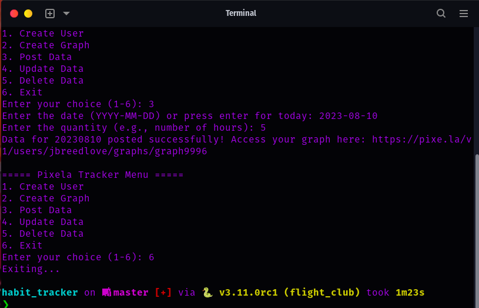

# Pixela Tracker

A Python script to interact with the Pixela API for tracking coding activities in a user-friendly manner.

## Features:
- Interactive menu-driven system.
- Create a new user on Pixela.
- Create a graph for tracking a habit.
- Post, update, or delete data on the graph.
- View the graph on Pixela's website.

## Setup:
1. Clone the GitHub repository: [habit_tracker_pixela](https://github.com/j-breedlove/habit_tracker_pixela.git)
2. Navigate to the project directory.
3. Install [pipenv](https://pipenv.pypa.io/en/latest/): `pip install pipenv`
4. Install the required libraries using pipenv: `pipenv install requests python-dotenv`
5. Activate the pipenv shell: `pipenv shell`
6. Add your Pixela `USERNAME` and `TOKEN` to the `.env` file.
7. Run the script: `python main_with_menu_enhanced.py`

## Usage:
The script provides an interactive menu. Simply run the script and follow the prompts to perform the desired actions.

## GitHub Repository:
[habit_tracker_pixela](https://github.com/j-breedlove/habit_tracker_pixela.git)
